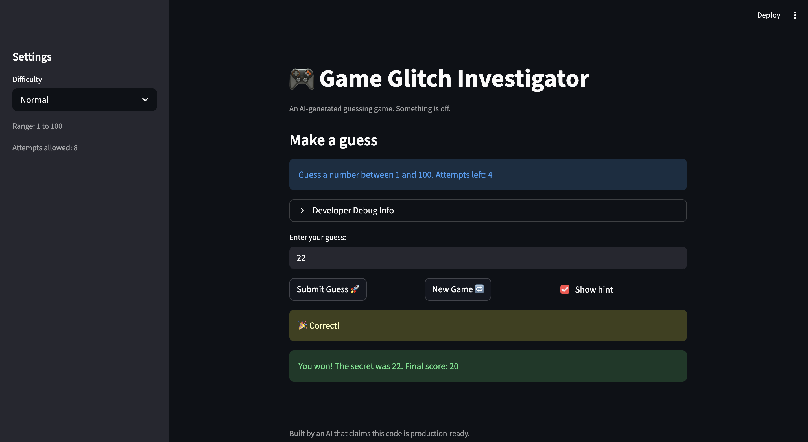
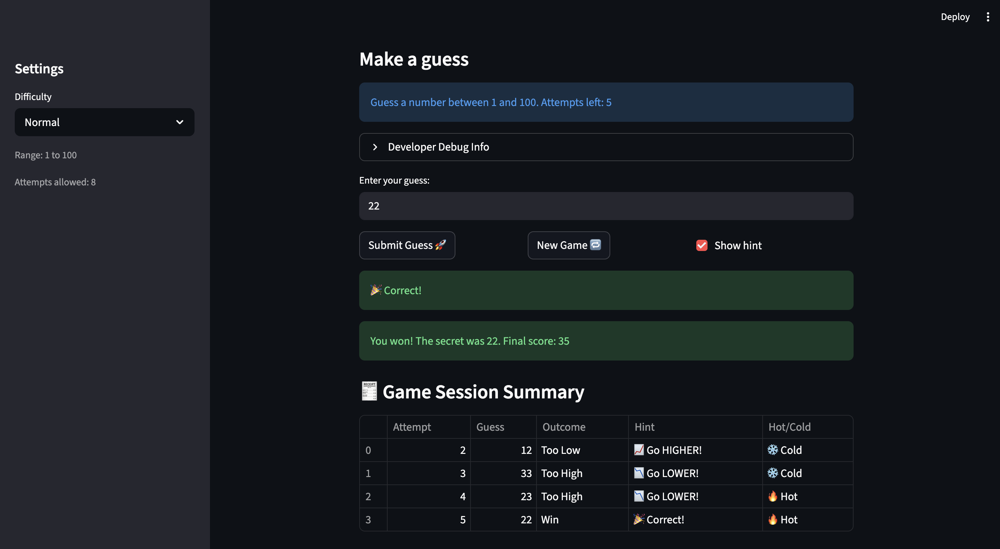

# 🎮 Game Glitch Investigator: The Impossible Guesser

## 🚨 The Situation

You asked an AI to build a simple "Number Guessing Game" using Streamlit.
It wrote the code, ran away, and now the game is unplayable. 

- You can't win.
- The hints lie to you.
- The secret number seems to have commitment issues.

## 🛠️ Setup

1. Install dependencies: `pip install -r requirements.txt`
2. Run the broken app: `python -m streamlit run app.py`

## 🕵️‍♂️ Your Mission

1. **Play the game.** Open the "Developer Debug Info" tab in the app to see the secret number. Try to win.
2. **Find the State Bug.** Why does the secret number change every time you click "Submit"? Ask ChatGPT: *"How do I keep a variable from resetting in Streamlit when I click a button?"*
3. **Fix the Logic.** The hints ("Higher/Lower") are wrong. Fix them.
4. **Refactor & Test.** - Move the logic into `logic_utils.py`.
   - Run `pytest` in your terminal.
   - Keep fixing until all tests pass!

## 📝 Document Your Experience

- [x] Describe the game's purpose.
  - The game is a number guessing challenge where the player guesses a secret number and gets higher/lower feedback until they win or run out of attempts.

- [x] Detail which bugs you found.
  - The app had persistent state issues: the secret number could get stale across difficulty changes and new games, and hints were inconsistent. There was also a TypeError from comparing ints and strings and a ValueError from unpacking the wrong return shape.

- [x] Explain what fixes you applied.
  - I refactored logic into `logic_utils.py`, fixed `new_game` and difficulty resets to update session state, ensured `check_guess` returns `(outcome, message)`, and updated the UI logic to use these values correctly. I also added and ran pytest regression tests to verify behavior.

## 📸 Demo

- [x] 

## 🚀 Stretch Features

- [x] Challenge 4: Enhanced Game UI with color-coded hints, hot/cold indicator, and session summary table.

